<div align="center">

</div>

#### 🌐 Company Site - [Here](https://faceplugin.com)
#### 🤗 Hugging Face - [Here](https://huggingface.co/FacePlugin-Ltd)
#### 🛟 Help Center - [Here](https://doc.faceplugin.com)
#### 🐳 Docker Hub - [Here](https://hub.docker.com/u/faceplugin)

# FacePlugin Face Recognition SDK — iOS (Fully On-Premise)

> **Ready in ~10 minutes (after framework download):**
> Unzip `facerecognitionsdk.framework.zip` (and the engine / ONNX zips) into this folder → Run on a phone
> Jump: [Quick start](#quick-start-checklist) · [Get the framework](#get-the-framework-facerecognitionsdkframework) · [Run the demo](#run-the-demo) · [Setup](#setup-on-your-own-app) · [About SDK](#about-sdk) · [Demo kit](#demo-kit)

Customer repo: [`FaceRecognition-iOS`](https://github.com/Faceplugin-ltd/FaceRecognition-iOS) · Help Center: [doc.faceplugin.com](https://doc.faceplugin.com)

## Quick start checklist

- [ ] Clone `https://github.com/Faceplugin-ltd/FaceRecognition-iOS`
- [ ] Download the three `.zip` files from [Google Drive](#get-the-framework-facerecognitionsdkframework)
- [ ] Unzip into this folder (`facerecognitionsdk.framework`, `FaceRecognitionEngine.framework`, `onnxruntime.framework`)
- [ ] Open `FaceRecognitionSDK.xcodeproj` → set **your** Team → Run on a **physical** iPhone
- [ ] Home status bar hides → **Enroll / Identify / Capture / Attribute** unlock

> **Your own app?** Skip to [Setup on your own app](#setup-on-your-own-app). Optional copy-paste helpers: [Demo kit](#demo-kit).

## Introduction

FacePlugin **Face Recognition SDK for iOS** is a fully on-device biometric engine for KYC and mobile onboarding. Enroll faces from gallery, identify in 1:N with live camera and 2D liveness, capture with an oval coach, and read attributes (liveness, quality, pose, age, gender, glasses, emotion, and more).

All processing stays on the iPhone. **No** biometric data is sent to FacePlugin cloud — built for banking, access control, and privacy-first identity apps.

This repository is the **iOS demo app** — a **standalone** customer repo. Runtime is `facerecognitionsdk.framework` at the repo root (download from Google Drive). No other FacePlugin repository is required.

Two layers:

1. **`facerecognitionsdk.framework`** — native engine (detect, templates, VideoWorker).
2. **`FaceRecognitionKit/`** — copy-paste Swift helpers (`FaceRecognitionClient`) so you can call every SDK function without rewriting threading, AVFoundation, or VideoWorker plumbing. See [Demo kit](#demo-kit).

### Main Functionalities

| Demo tile | What it does |
| --------- | ------------ |
| **Enroll** | Enroll a person from a gallery photo (exactly one face) into the on-device database |
| **Identify** | Live 1:N camera match (VideoWorker, stop on first hit) with 2D liveness / anti-spoofing |
| **Capture** | Oval coach capture → still with attributes → optional enroll |
| **Attribute** | Gallery analysis: landmarks, liveness, pose, quality, age, gender, emotion |
| **Settings** | Camera lens, identify / liveness / pose / eye-close thresholds |
| **About** | FacePlugin Face Recognition SDK — on-device identity |

Also: 14-point landmarks, template extraction, 1:N similarity, and offline license.

### Product List

| Platform | Repository |
|----------|------------|
| Android (Recognition) | [FaceRecognition-Android](https://github.com/Faceplugin-ltd/FaceRecognition-Android) |
| **iOS (Recognition)** | **[FaceRecognition-iOS](https://github.com/Faceplugin-ltd/FaceRecognition-iOS)** (**this repo**) |
| React Native (Recognition) | [FaceRecognition-React-Native](https://github.com/Faceplugin-ltd/FaceRecognition-React-Native) |
| Flutter (Recognition) | [FaceRecognition-Flutter](https://github.com/Faceplugin-ltd/FaceRecognition-Flutter) |
| Ionic Capacitor (Recognition) | [FaceRecognition-Ionic-Capacitor](https://github.com/Faceplugin-ltd/FaceRecognition-Ionic-Capacitor) |
| Ionic Cordova (Recognition) | [FaceRecognition-Ionic-Cordova](https://github.com/Faceplugin-ltd/FaceRecognition-Ionic-Cordova) |
| Windows (Recognition) | [FaceRecognition-Windows](https://github.com/Faceplugin-ltd/FaceRecognition-Windows) |
| Linux / Docker (Recognition) | [FaceRecognition-Docker](https://github.com/Faceplugin-ltd/FaceRecognition-Docker) |
| Android (Liveness) | [FaceLivenessDetection-Android](https://github.com/Faceplugin-ltd/FaceLivenessDetection-Android) |
| iOS (Liveness) | [FaceLivenessDetection-iOS](https://github.com/Faceplugin-ltd/FaceLivenessDetection-iOS) |
| Windows (Liveness) | [FaceLivenessDetection-Windows](https://github.com/Faceplugin-ltd/FaceLivenessDetection-Windows) |
| Linux / Docker (Liveness) | [FaceLivenessDetection-Docker](https://github.com/Faceplugin-ltd/FaceLivenessDetection-Docker) |


## Before you start

| Step | What you need |
| ---- | ------------- |
| 1 | Xcode 15+ and a **physical iPhone** (camera + liveness need a real device) |
| 2 | `facerecognitionsdk.framework` in this folder — see [Get the framework](#get-the-framework-facerecognitionsdkframework) |
| 3 | Demo license is already in the repo (`licenseKey` for `com.faceplugin.facerecognitionsdk`). Request a new key only if you change bundle id — see [SDK License](#sdk-license) |

You can run the sample app as-is. Enroll / Identify / Capture / Attribute stay dimmed until the engine finishes loading (the status bar then hides).

### System requirements

| Item | Minimum | Recommended |
| ---- | ------- | ----------- |
| iOS | 13.0 | 16 or newer |
| Device | iPhone with A12 or newer | Recent iPhone |
| RAM | 4 GB | 6 GB or more |
| Camera | Front camera | 720p or 1080p |
| Device | Physical device | Same; simulator is not for camera / liveness |

## Get the framework (`facerecognitionsdk.framework`)

`facerecognitionsdk.framework` is a header stub on GitHub because the binary is too large. On Drive it is shipped as **zips** — unzip after you download.

### Where to download

**[FaceRecognitionSDK-iOS-App runtime (Google Drive)](https://drive.google.com/drive/folders/1PKmV-o7gq7s7dDtiNgXPfCi2ZlWaRy5H)** — files: `facerecognitionsdk.framework.zip`, `FaceRecognitionEngine.framework.zip`, `onnxruntime.framework.zip`

### How to place it

1. Clone this repo (if you have not already):

```bash
git clone https://github.com/Faceplugin-ltd/FaceRecognition-iOS.git
cd FaceRecognition-iOS
```

2. Download the **`.zip`** files from the Drive folder.
3. **Unzip** each one (double-click in Finder, or `unzip facerecognitionsdk.framework.zip`). You should get `.framework` folders — not the `.zip`.
4. Put the unzipped frameworks **here** (repo root, next to `FaceRecognitionSDK.xcodeproj` — not in a nested folder, and not the zip files):

```text
FaceRecognition-iOS/
├── FaceRecognitionSDK.xcodeproj
├── FaceRecognitionKit/                 ← Swift module (in this repo)
├── FaceRecognitionSDK/                 ← demo UI
├── facerecognitionsdk.framework/       ← unzipped (not .zip)
├── FaceRecognitionEngine.framework/    ← unzipped (not .zip)
└── onnxruntime.framework/              ← unzipped (not .zip)
```

If unzip creates the `.framework` folders in Downloads, move them into this repo. You can delete the `.zip` files afterward.

## Run the demo

1. Open **FaceRecognitionSDK.xcodeproj** in Xcode.
2. Run on a device. The demo already has a valid `licenseKey` for `com.faceplugin.facerecognitionsdk`.
3. Set your **Team** for signing if needed.

Keep bundle id **`com.faceplugin.facerecognitionsdk`** for the included license.

The home status bar shows `Loading native SDK…` and then **hides** on success. Errors (`Invalid license!`, `License expired!`, `No activated!`, `Init error!`) stay on screen. Enroll / Identify / Capture / Attribute stay disabled until activation succeeds.

If the app **crashes at launch in dyld** (`SIGABRT` / `__abort_with_payload`), Xcode may have embedded a ~50KB Swift **link stub** instead of the real `facerecognitionsdk`. The **Sync Embedded Frameworks** build phase re-copies the vendor frameworks after every build (`scripts/sync_embedded_frameworks.sh`). If it still happens: **Product → Clean Build Folder** (⇧⌘K) and Run again.

### Screenshots

| Home | Identify | Capture |
| ---- | -------- | ------- |
| <p align="center">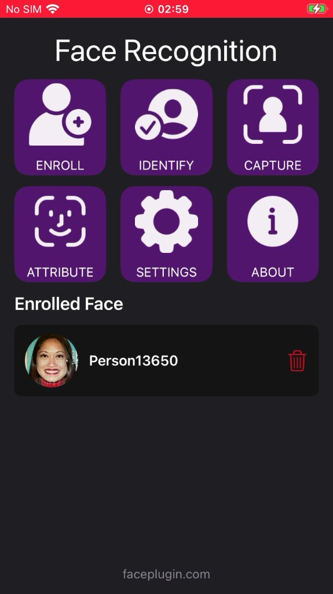</p> | <p align="center">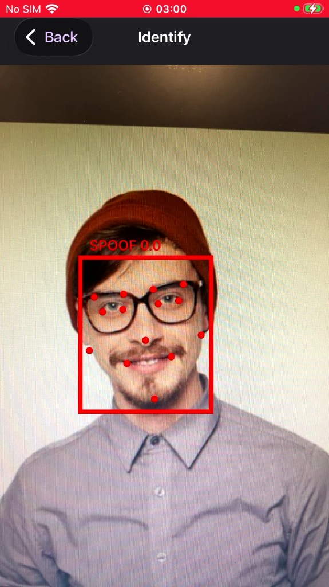</p> | <p align="center">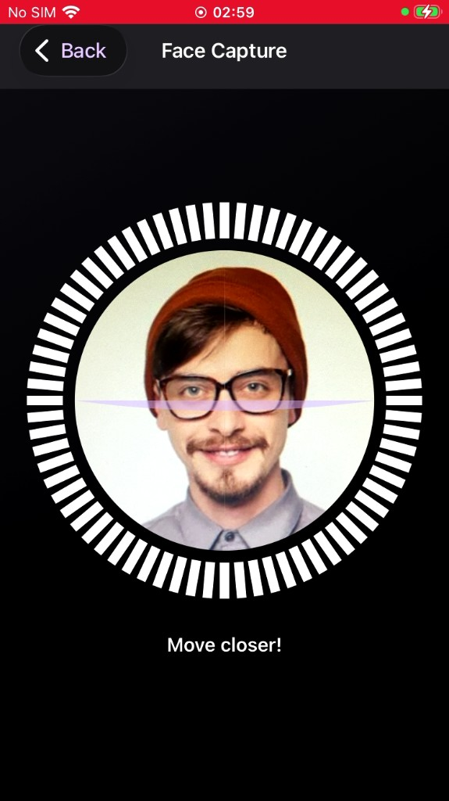</p> |

| Capture result | Attribute | Attribute (emotion) |
| -------------- | --------- | ------------------- |
| <p align="center">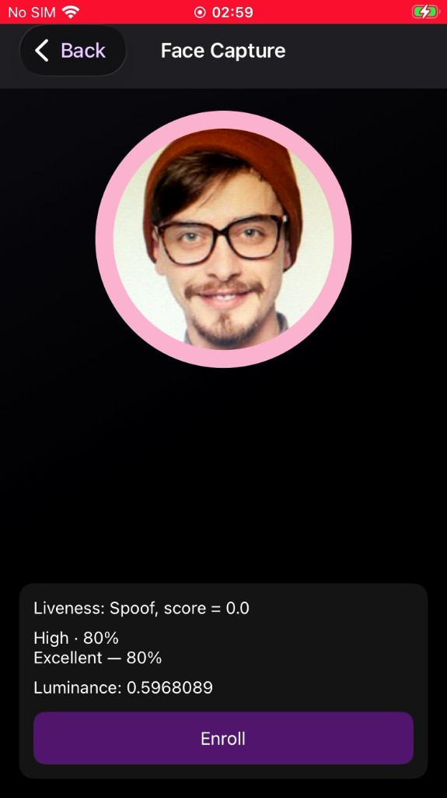</p> | <p align="center">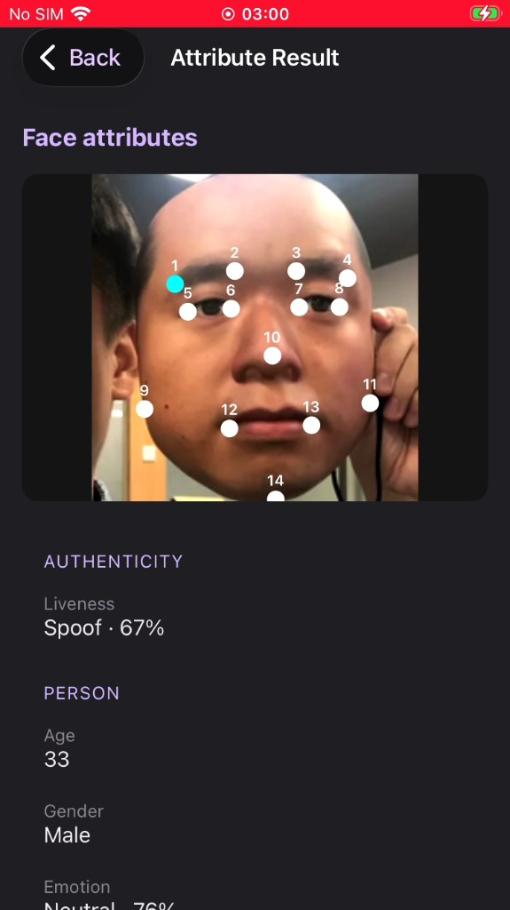</p> | <p align="center">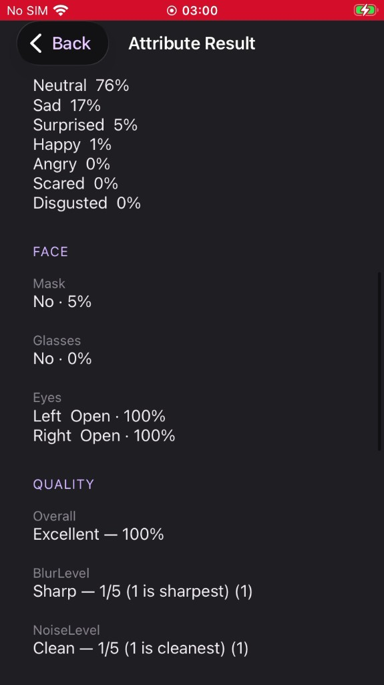</p> |

| Attribute (quality) | Settings | About |
| ------------------- | -------- | ----- |
| <p align="center">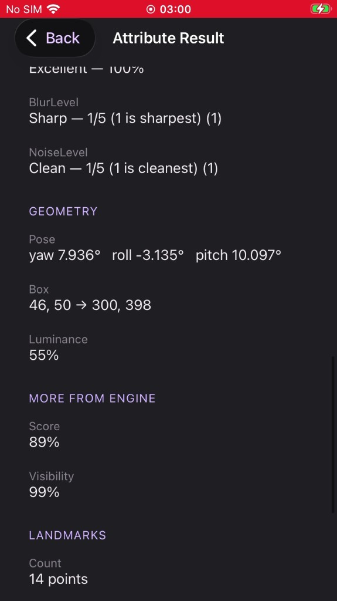</p> | <p align="center">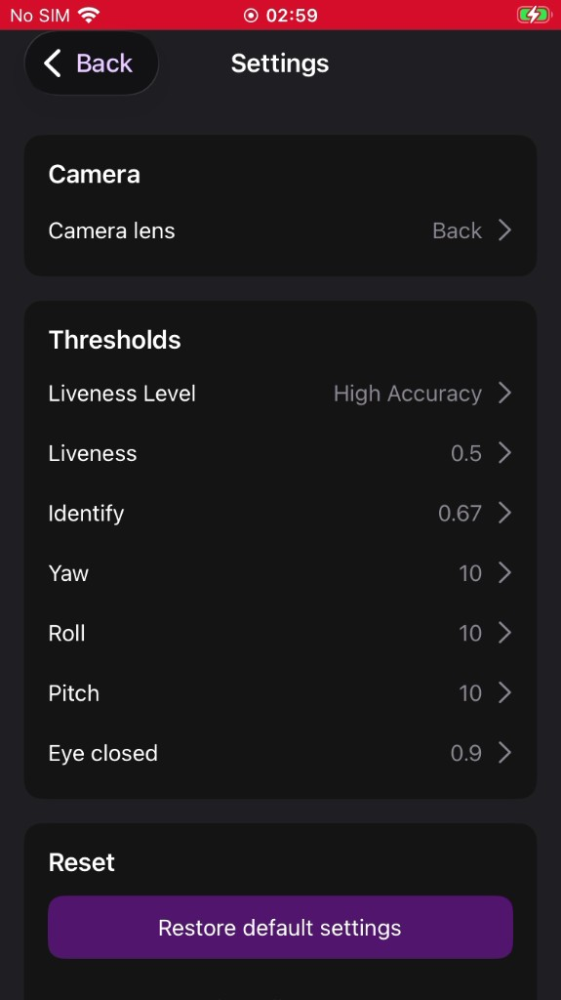</p> | <p align="center">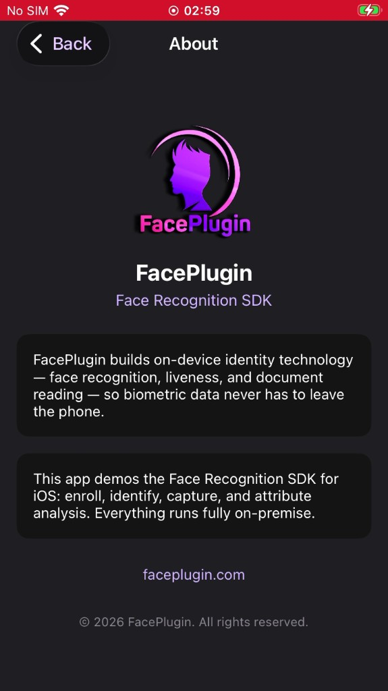</p> |

| Attribute (liveness) | Attribute (landmarks) |
| -------------------- | --------------------- |
| <p align="center">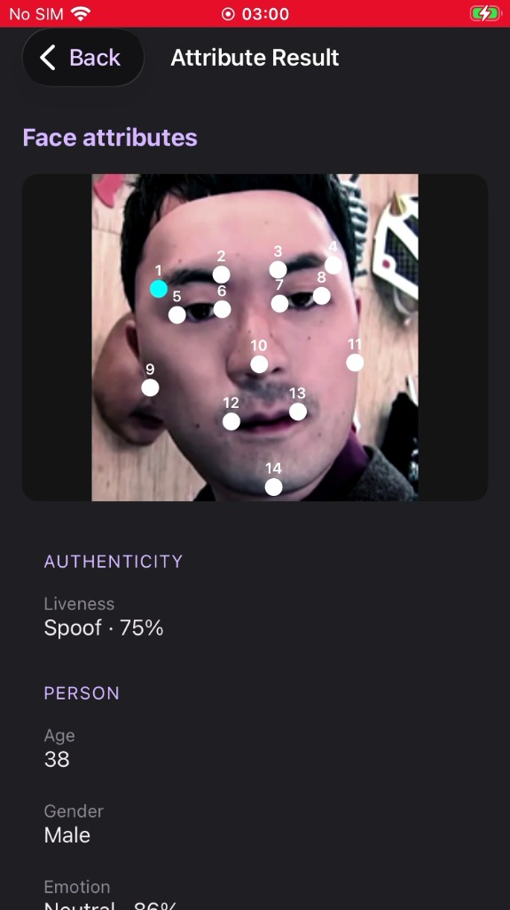</p> | <p align="center">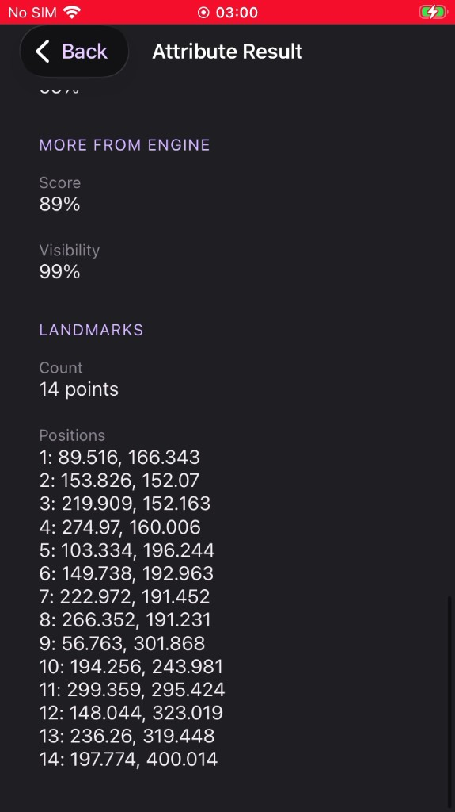</p> |

## SDK License

Licenses are **offline** and bound to your bundle identifier.

The sample app already includes a valid key for `com.faceplugin.facerecognitionsdk`. You only need a new key if you use a different bundle identifier.

### How to get a license

The code below shows how to use the license:

[https://github.com/Faceplugin-ltd/FaceRecognition-iOS/blob/a83d7d82046d388e6d58c78579f0453d4b4d141a/FaceRecognitionSDK/Home/ViewController.swift#L8-L10](https://github.com/Faceplugin-ltd/FaceRecognition-iOS/blob/a83d7d82046d388e6d58c78579f0453d4b4d141a/FaceRecognitionSDK/Home/ViewController.swift#L8-L10)

[https://github.com/Faceplugin-ltd/FaceRecognition-iOS/blob/a83d7d82046d388e6d58c78579f0453d4b4d141a/FaceRecognitionSDK/Home/ViewController.swift#L167-L191](https://github.com/Faceplugin-ltd/FaceRecognition-iOS/blob/a83d7d82046d388e6d58c78579f0453d4b4d141a/FaceRecognitionSDK/Home/ViewController.swift#L167-L191)

Please [contact us](#contact) to get a license for **your own app**.

## Setup on your own app

Copy **FaceRecognitionKit** (Swift module) and the vendor frameworks into your project, request a license for **your** bundle id, activate once at launch, then call the kit APIs used in the demo screens.

1. Add `facerecognitionsdk.framework`, `FaceRecognitionEngine.framework`, and `onnxruntime.framework` to your target (Embed & Sign).
2. Copy the **FaceRecognitionKit** folder from this repo into your project.
3. Activate at launch:

```swift
FaceRecognitionClient.shared.activate(license: "FP1.…") { code in
    // 0 = success — enable camera / gallery UI
}
```

4. Camera / photo permissions in `Info.plist`:

```xml
<key>NSCameraUsageDescription</key>
<string>Camera is used to capture and identify faces.</string>
<key>NSPhotoLibraryUsageDescription</key>
<string>Photo library is used to enroll and analyze faces.</string>
```

The license is bound to **your** bundle id. Request a key for that id, not the demo’s.

Call SDK work **off the main thread** via `FaceRecognitionClient.shared.async { … }`. First init unpacks on-device models (expect a few seconds). Then follow [About SDK](#about-sdk). Full API: [doc.faceplugin.com](https://doc.faceplugin.com).

## About SDK

Use **FaceRecognitionKit** (`FaceRecognitionClient.shared`) in Swift, or call `FaceRecognitionSDK` from Objective-C++. All work stays on the device. `0` = success.

Call **once per process**, off the **main** thread: `activate(license:)` (`setActivation` → `initSDK`). The engine is **not** concurrent — serialize calls (or copy the [Demo kit](#demo-kit)). Do not copy `ViewController` / `IdentifyCameraViewController` unless you want the demo UI.

| Your product needs | Call this |
| ------------------ | --------- |
| Start the engine | `activate(license:)` |
| Find a face / attributes | `faceDetection` (purpose `.fullAttributes`) |
| Save a person | `templateExtraction` → store `Data` in **your** DB |
| 1:1 / 1:N | `similarity` (or kit `bestMatch`) |
| Live camera box + 1:N | `VideoWorker` (`start` → `syncDatabase` → `addFrame`) |
| Stop | `stopVideoWorker` then `deactivate` |

```swift
FaceRecognitionClient.shared.activate(license: "FP1.…") { code in
    if code == 0 {
        FaceRecognitionClient.shared.loadDatabase()
        // enable Enroll / Identify / Capture / Attribute
    }
}
```

Feed **upright, unmirrored** frames into detect / VideoWorker. Mirror boxes on the overlay only. Stills downscale to long side **1280**; live frames ~**640** is enough.

```swift
let prepared = CameraFrameUtils.enginePreparedImage(image)
let faces = FaceRecognitionClient.shared.faceDetection(from: prepared, purpose: .fullAttributes)
guard faces.count == 1, let template = FaceRecognitionClient.shared.templateExtraction(from: prepared, face: faces[0]) else { return }
let hit = FaceRecognitionClient.shared.bestMatch(for: template, threshold: 0.67)
```

| Code | Meaning |
| ---- | ------- |
| 0 | Activate / init OK |
| 1 | Invalid license |
| 2 | Expired license |
| 3 | Not activated |
| 4 | Init failed |

## Demo kit

`FaceRecognitionKit/` is **not** inside the framework. Copy that Swift folder if you want the demo’s wiring instead of calling `FaceRecognitionSDK` yourself.

Use **`FaceRecognitionClient.shared`** as the only entry. Do not mix raw `FaceRecognitionSDK.*` on other threads while the client is running.

| File | Use it for |
| ---- | ---------- |
| `FaceRecognitionClient` | Activate, detect, enroll, 1:N, VideoWorker |
| `SDKQueue` | Serial native access; live `addFrame` does not block the camera |
| `FaceDatabase` | Local enrolled people (`Documents/face_database.json`) |
| `CameraFrameUtils` | `CMSampleBuffer` → upright image; gallery ≤ 1280; live ≤ 640 |
| `LiveDetect` / `IdentityLiveness` | Live 2D liveness / eyes + active-liveness configs |
| `FaceJSON` / `FaceModels` | Parse detect JSON and VideoWorker events |

```swift
let client = FaceRecognitionClient.shared
client.activate(license: "FP1.…") { code in
    if code == 0 { client.loadDatabase() }
}
```

Camera preview bind lives in the demo (`BaseCameraViewController`), not the kit.

Skip the kit if you already have a camera pipeline and a person DB — then call `FaceRecognitionSDK` on **one** background queue.

## Contact

<div align="left">
<a target="_blank" href="mailto:info@faceplugin.com"></a>&emsp;
<a target="_blank" href="https://wa.me/+14692784822"></a>
</div>
